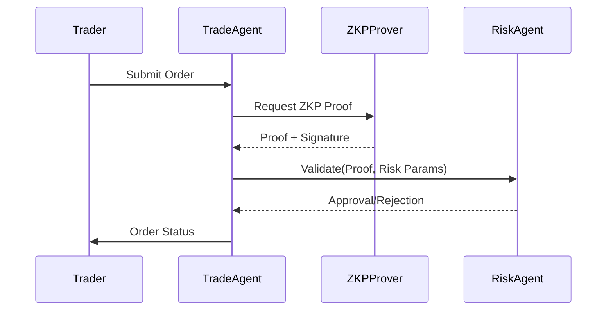
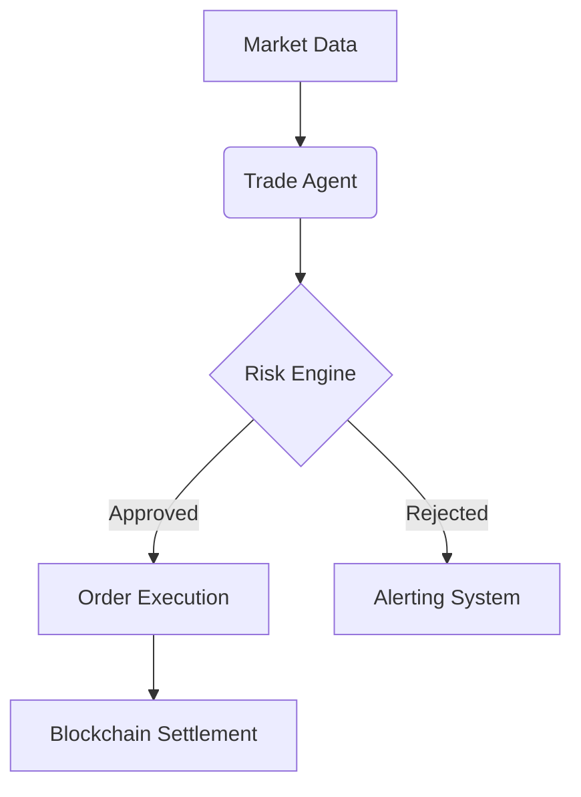

# Anvora AI - Next-Gen AI Asset Management Platform

[](https://opensource.org/licenses/Apache-2.0)
[](https://www.python.org/)
[](https://www.ray.io/)
[](https://github.com/yourorg/gradual-agent/actions)

**Anvora AI** is an open-source multi-agent framework for intelligent asset management, combining real-time security protocols, quantitative trading strategies, and decentralized AI decision-making.

## WEB: (https://anvoraai.com/)
[](https://twitter.com/AnvoraAI)
[](https://www.linkedin.com/in/alexprokofiev/)

```

                                                                                                                                                            
         .8.          b.             8 `8.`888b           ,8'  ,o888888o.     8 888888888o.            .8.                             .8.           8 8888 
        .888.         888o.          8  `8.`888b         ,8'. 8888     `88.   8 8888    `88.          .888.                           .888.          8 8888 
       :88888.        Y88888o.       8   `8.`888b       ,8',8 8888       `8b  8 8888     `88         :88888.                         :88888.         8 8888 
      . `88888.       .`Y888888o.    8    `8.`888b     ,8' 88 8888        `8b 8 8888     ,88        . `88888.                       . `88888.        8 8888 
     .8. `88888.      8o. `Y888888o. 8     `8.`888b   ,8'  88 8888         88 8 8888.   ,88'       .8. `88888.                     .8. `88888.       8 8888 
    .8`8. `88888.     8`Y8o. `Y88888o8      `8.`888b ,8'   88 8888         88 8 888888888P'       .8`8. `88888.                   .8`8. `88888.      8 8888 
   .8' `8. `88888.    8   `Y8o. `Y8888       `8.`888b8'    88 8888        ,8P 8 8888`8b          .8' `8. `88888.                 .8' `8. `88888.     8 8888 
  .8'   `8. `88888.   8      `Y8o. `Y8        `8.`888'     `8 8888       ,8P  8 8888 `8b.       .8'   `8. `88888.               .8'   `8. `88888.    8 8888 
 .888888888. `88888.  8         `Y8o.`         `8.`8'       ` 8888     ,88'   8 8888   `8b.    .888888888. `88888.             .888888888. `88888.   8 8888 
.8'       `8. `88888. 8            `Yo          `8.`           `8888888P'     8 8888     `88. .8'       `8. `88888.           .8'       `8. `88888.  8 8888 

```


                                                                                                                     


---


## Security Validation Flow



---

## 🌟 Key Features

### **Multi-Agent Collaboration**
```python
# Example: Agent orchestration
from gradual_agent import AgentCluster
cluster = AgentCluster(ray_address="auto")
cluster.deploy_agents(["TradeAgent", "RiskAgent", "MonitorAgent"])
```

### Real-Time Security
- Zero-Knowledge Proofs (ZKP): Verify transactions without exposing sensitive data
- Dynamic Risk Thresholds: Auto-adjust based on market volatility
- Hardware Security Modules (HSM): FIPS 140-2 Level 3 compliance

### Quantitative Trading
```
# Example: Momentum strategy
class MomentumStrategy(StrategyBase):
    def execute(self, data: MarketData) -> List[Order]:
        returns = data.close.pct_change(periods=30)
        return [Order(symbol="BTC-USD", side="BUY" if returns[-1] > 0 else "SELL")]
```

### Enterprise Features

|  Feature  |  Description  |
|---------|---------|
|  Federated Learning  |  Train models across siloed datasets  |
|  Dark Pool Routing  |  Minimize market impact  |
| Regulatory Audit  |  SEC/MiFID II compliant logs  |

## 🛠 Technical Architecture

### Core Components
```
.
├── agents/           # Autonomous agents
│   ├── core/         # Base agent classes
│   ├── trade/        # Quantitative strategies
│   └── security/     # ZKP/HSM integration
├── cluster/          # Ray distributed computing
├── risk/             # Real-time risk engine
├── comms/            # gRPC/WebSocket messaging
└── monitoring/       # Prometheus/Grafana dashboards
```
### Data Flow


## 🚀 Quick Start

### Prerequisites
- Python 3.9+
- Redis 6.2+
- Ray 2.5+

### Installation
```
# 1. Clone repo
git clone https://github.com/yourorg/Anvora-AI.git

# 2. Install dependencies
poetry install --with dev,docs

# 3. Start Ray cluster
ray start --head --port=6379

# 4. Run main service
python -m Anvora_AI.main --config config/prod.yaml
```

### Docker Deployment
```
# docker-compose.prod.yaml
services:
  Anvora-AI:
    image: yourorg/Anvora-AI:2.3.0
    environment:
      - RAY_ADDRESS=ray-head:6379
    deploy:
      resources:
        limits:
          cpus: '4'
          memory: 16G
```

## 🔧 Advanced Configuration
### gRPC Endpoints
```
# config/prod.yaml
grpc:
  port: 50051
  max_workers: 100
  interceptors:
    - name: ZKPValidator
      params:
        proof_system: "groth16"
```

### Performance Tuning
```
# Tune Ray resources
@ray.remote(num_cpus=2, num_gpus=0.5)
class TradeAgent(AgentBase):
    def __init__(self, config: TradingConfig):
        self.strategy = MomentumStrategy(window=30)
```

## 🧩 Modules
### Security Subsystem
```
from Anvora-AI.security.zkp_prover import ZKProver

prover = ZKProver(protocol="groth16")
proof = prover.generate_proof(
    public_inputs={"tx_hash": "0x123..."},
    private_inputs={"secret_key": "0x456..."}
)
```

### AI Training
```
# Run federated learning job
python -m gradual_agent.fl.train \
    --num-rounds 100 \
    --batch-size 128 \
    --partitions 10
```

## 🤝 Contributing
### Development Workflow
```
# 1. Create feature branch
git checkout -b feature/awesome-thing

# 2. Run tests
pytest tests/ --cov=Anvora_AI

# 3. Submit PR
gh pr create --base main --title "Add awesome thing"
```

### Code Standards
- Type Hints: Enforced via mypy
- Documentation: Google-style docstrings
- Testing: 90%+ coverage required

