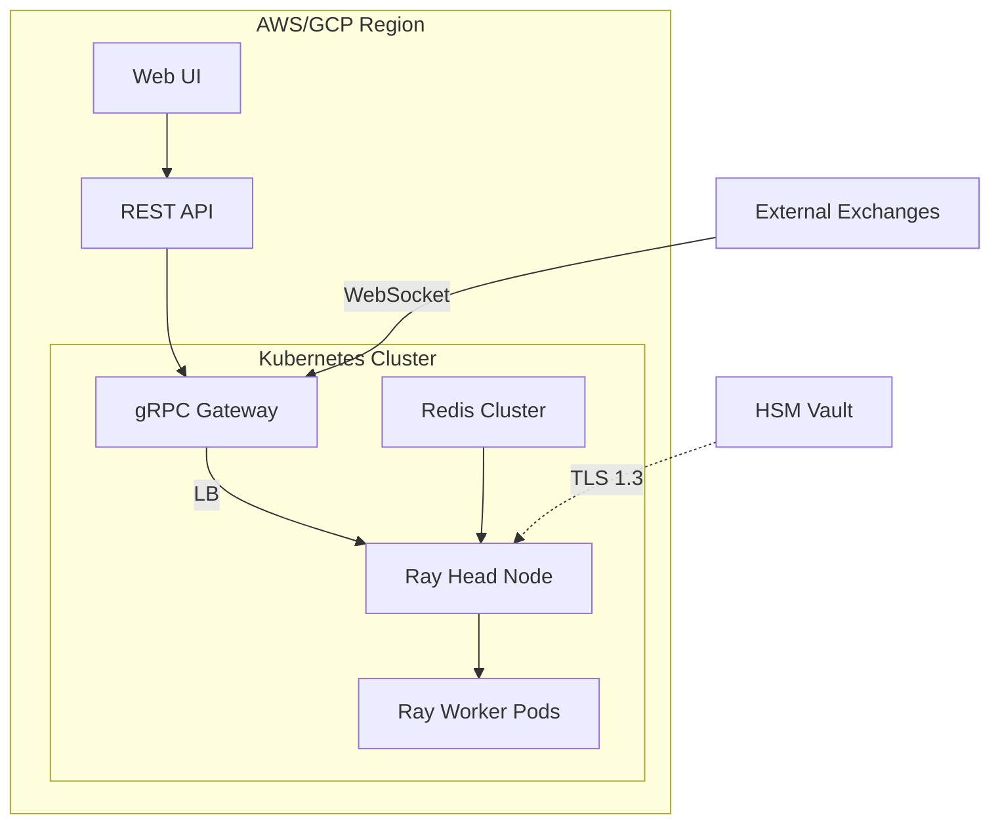
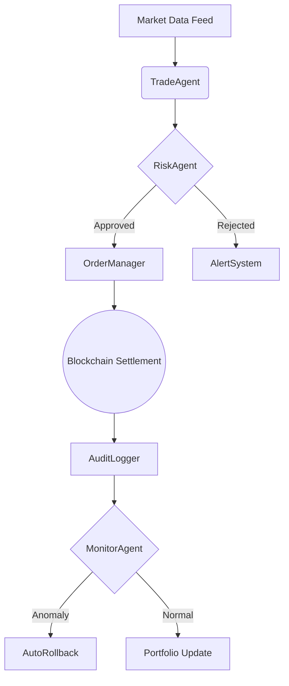
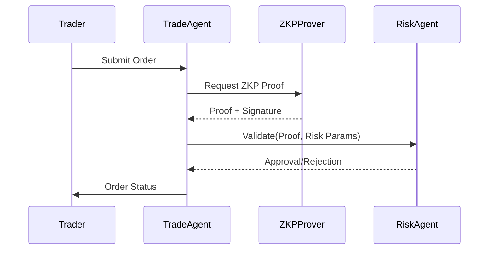
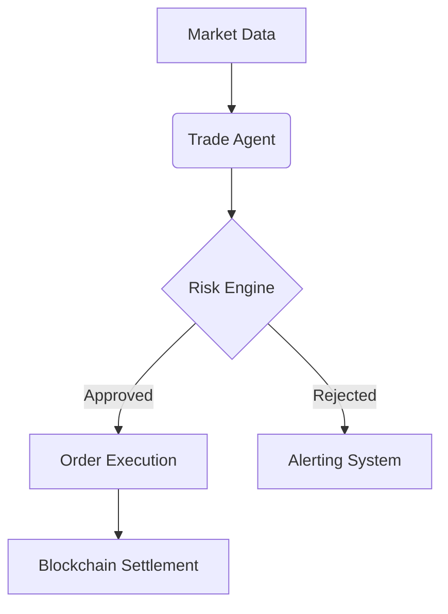

# Gradual AGENT - Next-Gen AI Asset Management Platform

[](https://opensource.org/licenses/Apache-2.0)
[](https://www.python.org/)
[](https://www.ray.io/)
[](https://github.com/yourorg/gradual-agent/actions)

**Gradual AGENT** is an open-source multi-agent framework for intelligent asset management, combining real-time security protocols, quantitative trading strategies, and decentralized AI decision-making.

## WEB: https://gradual.world/
[](https://twitter.com/GradualAGENT)
[](https://www.linkedin.com/in/george-samwick-a05b1218a/)

```

                                                                                                                        
                                                                    dddddddd                                            
        GGGGGGGGGGGGG                                               d::::::d                                    lllllll 
     GGG::::::::::::G                                               d::::::d                                    l:::::l 
   GG:::::::::::::::G                                               d::::::d                                    l:::::l 
  G:::::GGGGGGGG::::G                                               d:::::d                                     l:::::l 
 G:::::G       GGGGGGrrrrr   rrrrrrrrr   aaaaaaaaaaaaa      ddddddddd:::::d uuuuuu    uuuuuu    aaaaaaaaaaaaa    l::::l 
G:::::G              r::::rrr:::::::::r  a::::::::::::a   dd::::::::::::::d u::::u    u::::u    a::::::::::::a   l::::l 
G:::::G              r:::::::::::::::::r aaaaaaaaa:::::a d::::::::::::::::d u::::u    u::::u    aaaaaaaaa:::::a  l::::l 
G:::::G    GGGGGGGGGGrr::::::rrrrr::::::r         a::::ad:::::::ddddd:::::d u::::u    u::::u             a::::a  l::::l 
G:::::G    G::::::::G r:::::r     r:::::r  aaaaaaa:::::ad::::::d    d:::::d u::::u    u::::u      aaaaaaa:::::a  l::::l 
G:::::G    GGGGG::::G r:::::r     rrrrrrraa::::::::::::ad:::::d     d:::::d u::::u    u::::u    aa::::::::::::a  l::::l 
G:::::G        G::::G r:::::r           a::::aaaa::::::ad:::::d     d:::::d u::::u    u::::u   a::::aaaa::::::a  l::::l 
 G:::::G       G::::G r:::::r          a::::a    a:::::ad:::::d     d:::::d u:::::uuuu:::::u  a::::a    a:::::a  l::::l 
  G:::::GGGGGGGG::::G r:::::r          a::::a    a:::::ad::::::ddddd::::::ddu:::::::::::::::uua::::a    a:::::a l::::::l
   GG:::::::::::::::G r:::::r          a:::::aaaa::::::a d:::::::::::::::::d u:::::::::::::::ua:::::aaaa::::::a l::::::l
     GGG::::::GGG:::G r:::::r           a::::::::::aa:::a d:::::::::ddd::::d  uu::::::::uu:::u a::::::::::aa:::al::::::l
        GGGGGG   GGGG rrrrrrr            aaaaaaaaaa  aaaa  ddddddddd   ddddd    uuuuuuuu  uuuu  aaaaaaaaaa  aaaallllllll

```


                                                                                                                     


---
## Deployment Architecture

## Multi-Agent Orchestration

## Security Validation Flow



---

## 🌟 Key Features

### **Multi-Agent Collaboration**
```python
# Example: Agent orchestration
from gradual_agent import AgentCluster
cluster = AgentCluster(ray_address="auto")
cluster.deploy_agents(["TradeAgent", "RiskAgent", "MonitorAgent"])
```

### Real-Time Security
- Zero-Knowledge Proofs (ZKP): Verify transactions without exposing sensitive data
- Dynamic Risk Thresholds: Auto-adjust based on market volatility
- Hardware Security Modules (HSM): FIPS 140-2 Level 3 compliance

### Quantitative Trading
```
# Example: Momentum strategy
class MomentumStrategy(StrategyBase):
    def execute(self, data: MarketData) -> List[Order]:
        returns = data.close.pct_change(periods=30)
        return [Order(symbol="BTC-USD", side="BUY" if returns[-1] > 0 else "SELL")]
```

### Enterprise Features

|  Feature  |  Description  |
|---------|---------|
|  Federated Learning  |  Train models across siloed datasets  |
|  Dark Pool Routing  |  Minimize market impact  |
| Regulatory Audit  |  SEC/MiFID II compliant logs  |

## 🛠 Technical Architecture

### Core Components
```
.
├── agents/           # Autonomous agents
│   ├── core/         # Base agent classes
│   ├── trade/        # Quantitative strategies
│   └── security/     # ZKP/HSM integration
├── cluster/          # Ray distributed computing
├── risk/             # Real-time risk engine
├── comms/            # gRPC/WebSocket messaging
└── monitoring/       # Prometheus/Grafana dashboards
```
### Data Flow


## 🚀 Quick Start

### Prerequisites
- Python 3.9+
- Redis 6.2+
- Ray 2.5+

### Installation
```
# 1. Clone repo
git clone https://github.com/yourorg/gradual-agent.git

# 2. Install dependencies
poetry install --with dev,docs

# 3. Start Ray cluster
ray start --head --port=6379

# 4. Run main service
python -m gradual_agent.main --config config/prod.yaml
```

### Docker Deployment
```
# docker-compose.prod.yaml
services:
  gradual-agent:
    image: yourorg/gradual-agent:2.3.0
    environment:
      - RAY_ADDRESS=ray-head:6379
    deploy:
      resources:
        limits:
          cpus: '4'
          memory: 16G
```

## 🔧 Advanced Configuration
### gRPC Endpoints
```
# config/prod.yaml
grpc:
  port: 50051
  max_workers: 100
  interceptors:
    - name: ZKPValidator
      params:
        proof_system: "groth16"
```

### Performance Tuning
```
# Tune Ray resources
@ray.remote(num_cpus=2, num_gpus=0.5)
class TradeAgent(AgentBase):
    def __init__(self, config: TradingConfig):
        self.strategy = MomentumStrategy(window=30)
```

## 🧩 Modules
### Security Subsystem
```
from gradual_agent.security.zkp_prover import ZKProver

prover = ZKProver(protocol="groth16")
proof = prover.generate_proof(
    public_inputs={"tx_hash": "0x123..."},
    private_inputs={"secret_key": "0x456..."}
)
```

### AI Training
```
# Run federated learning job
python -m gradual_agent.fl.train \
    --num-rounds 100 \
    --batch-size 128 \
    --partitions 10
```

## 🤝 Contributing
### Development Workflow
```
# 1. Create feature branch
git checkout -b feature/awesome-thing

# 2. Run tests
pytest tests/ --cov=gradual_agent

# 3. Submit PR
gh pr create --base main --title "Add awesome thing"
```

### Code Standards
- Type Hints: Enforced via mypy
- Documentation: Google-style docstrings
- Testing: 90%+ coverage required

